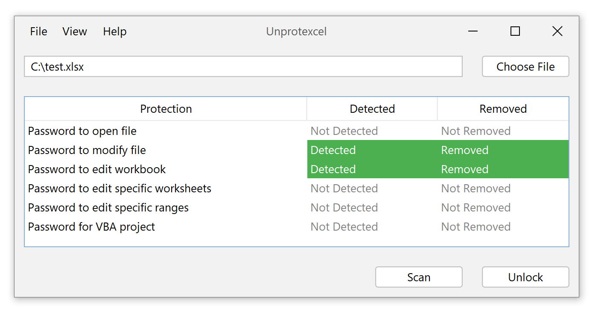

# Unprotexcel

**Unprotexcel** is a lightweight Java-based tool built with Maven designed to remove editing protection from Excel files, perfect for when you have forgotten the password. With a user-friendly interface and robust features, this tool ensures you can access and modify your Excel files with ease.

<div align="center">
    
</div>

## Getting started

### Prerequisites
Ensure you have the following installed:
- [Java Development Kit (JDK)](https://www.oracle.com/java/technologies/javase-jdk11-downloads.html)
- [Apache Maven](https://maven.apache.org/)

### Installation

1. **Clone the repository:**
    ```bash
    git clone https://github.com/azmke/unprotexcel.git
    cd excel-sheet-unlocker
    ```

2. **Build the project with Maven:**
    ```bash
    mvn clean install
    ```

3. **Run the application:**
    ```bash
    java -jar target/unprotexcel-0.1.0-SNAPSHOT.jar
    ```

## Contributing

We welcome contributions from the community! Here's how you can help:

### Reporting Bugs
If you encounter a bug, please open an [issue](https://github.com/azmke/unprotexcel/issues).

### Suggesting Features
We are always open to new ideas. If you have a feature request, please open an [issue](https://github.com/azmke/unprotexcel/issues).

### Code Contributions
1. **Fork the repository** on GitHub.
2. **Create a feature branch:**
    ```bash
    git checkout -b feature/AmazingFeature
    ```
3. **Commit your changes:**
    ```bash
    git commit -m 'Add some AmazingFeature'
    ```
4. **Push to the branch:**
    ```bash
    git push origin feature/AmazingFeature
    ```
5. **Open a Pull Request**.


## License

This project is licensed under the terms of the GNU General Public License v3.0. See the [LICENSE](./LICENSE) file for details.

## Disclaimer

By using this tool, you agree to the terms and conditions outlined in the [DISCLAIMER.md](DISCLAIMER.md).
